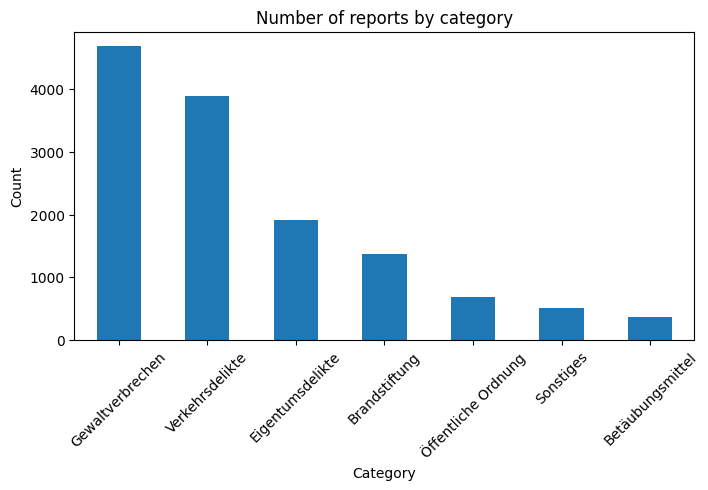

# Berlin Police Reports

A data collection and classification project for Berlin police reports.
It scrapes official reports from [berlin.de](https://www.berlin.de/polizei/polizeimeldungen/)
, stores them as CSV files, and classifies them into categories using Ollama LLM models.

# Features

- 📑 Full scrape of Berlin police reports (2014 → present).

- 🔄 Incremental updates — fetches only new reports since last saved.

- 🗂️ Saves results into yearly CSV files with metadata (date, title, link, location, description).

- 🤖 Automatic classification into categories such as:

   - Violent crimes

   - Property crimes

   - Traffic offenses

   - Drug-related crimes

   - Arson

   - Public order

   - Other
 
# Requirements

- Python 3.9+

- Chrome browser + ChromeDriver

- Installed Python packages [requirements.txt](./requirements.txt)

- Ollama
  - installed and running locally (for classification).

  - Example:

    - ```bash
      ollama run llama3.1:8b

# Usage
##  1. Full scrape of all reports
```python scraper_fullscrape.py```


- Saves data as berlin_polizei_\<year>.csv for each year.

##  2. Update with new reports (example: 2025)
```python scraper_updateForNewReports.py```


- Adds newly published reports into berlin_reports_yearly/berlin_polizei_2025.csv.


##  3. Scrape descriptions
```python description_scraper2```


- Adds scraped descriptions using stored links to specific reports

  
##  4. Translating german report titles into english
```python title_translator```

```python title_translator_with_batches```


- Translates title into en_title

- Daily limitation (no API key)

##  5. Classify reports with Ollama

- Tests classification on sample cases.
 
```python ollama_classifier.py```


- classifying all the data files
 
```python ollama_classifier_working.py```

# Data Analysis

- [Berlin_police_reports.ipynb](./Berlin_police_reports.ipynb) → Main Jupyter notebook with data loading, cleaning, visualization, and insights.
- The notebook covers:

  - Data preprocessing & cleaning

  - Exploratory statistics (incident counts, categories, time distribution)

  - Geospatial analysis of crime locations in Berlin

  - Trend visualization over time

  - Identification of high-risk areas

## EDA (Exploratory Data Analysis)

- In the EDA phase, the notebook inspects and explores the raw Berlin police report files (CSV/XLSX):

  - Loaded and concatenated multiple yearly report files into a single DataFrame

  - Examined the shape, column names, data types, and missing values

  - Checked unique categories of incidents and most frequent report locations

  - Performed initial frequency counts (e.g., incident categories, top 10 locations)

## Data preparation

- The dataset required several cleaning and transformation steps before analysis:

  - Converted the ```date``` column (e.g., ```"05.11.2014 12:15 Uhr"```) into a proper datetime format
  
  - Extracted useful temporal features: ```year```, ```month```, and ```day```
  
  - Standardized column names for consistency
  
  - Created a clean working DataFrame (```df_clean```) for subsequent analysis

## Data visualization

- The prepared dataset was then visualized to highlight key patterns:

  - Bar plots showing the distribution of reports across categories
  
  - Yearly trends of reports (counts per year)
  
  - Location analysis with top 10 most reported places
  
  - Additional plots to reveal temporal and categorical trends
 
  - Plots analyzing reports per 100k residents by district
 
  - Plots analyzing reports per km² by district

## Results





